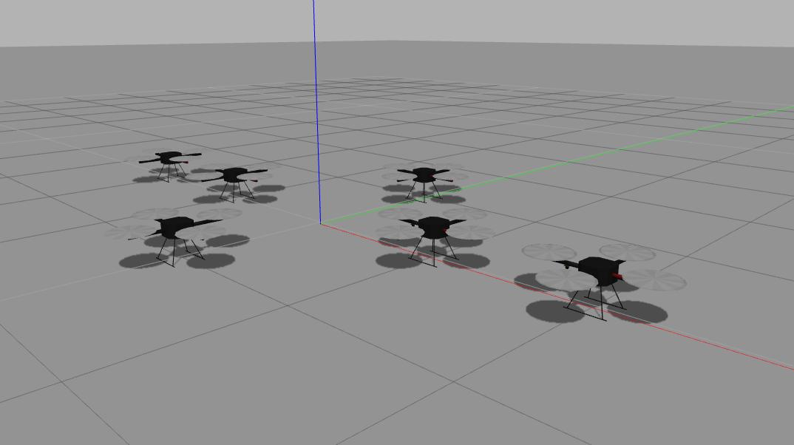

# hector_quadrotor_gazebo_simulation

hector_quadrotor for UAVs swarm simulation

### complining the package
In a new terminal 

```
mkdir -p ~/catkin_ws/src

cd catkin_ws/src

git clone https://github.com/Marslanali/quadrotor-simulation
 
catkin_make
```

### Simulating UAV in Gazebo
Load the Gazebo simulator in separate terminals using the following commands:

```
roslaunch hector_quadrotor_demo uav_outdoor_flight_gazebo.launch
```

In a new terminal

```
rosservice call /enable_motors "enable: true"
```

### Simulation screenshots

<p align="left">
   
  <br/>
  Fig. 1. uav in empty gazebo world
</p>


#### Publishing cmd vel:

```
rostopic pub -r 10 /cmd_vel geometry_msgs/Twist  '{linear:  {x: 0, y: 0.0, z: 1.0}, angular: {x: 0.0,y: 0.0,z: 0.0}}'
```

#### Running keyboard teleop:

Start the teleop node:
```
rosrun teleop_twist_keyboard teleop_twist_keyboard.py
```

# Usage
```
Reading from the keyboard  and Publishing to Twist!
---------------------------
Moving around:
   u    i    o
   j    k    l
   m    ,    .

For Holonomic mode (strafing), hold down the shift key:
---------------------------
   U    I    O
   J    K    L
   M    <    >

t : up (+z)
b : down (-z)

anything else : stop

q/z : increase/decrease max speeds by 10%
w/x : increase/decrease only linear speed by 10%
e/c : increase/decrease only angular speed by 10%

CTRL-C to quit
```

### Getting RGB image to display

```
rosrun image_view image_view image:=/front_cam/camera/image
```

### Simulating Swarm of UAV in Gazebo
Load the Gazebo simulator in separate terminals using the following commands:

```
roslaunch hector_quadrotor_demo uav_swarm_outdoor_flight_gazebo.launch
```


### Simulation screenshots

<p align="left">
   
   
  <br/>
  Fig. 1. multiple uavs in gazebo
</p>


### Enabling motors

```
cd ~/quadrotor-simulation
chmod +x motors_enables_uav_swarm.sh
./motors_enables_uav_swarm.sh
```

#### controling uav1 by publishing /uav1/cmd_vel:

```
rostopic pub -r 10 /uav1/cmd_vel geometry_msgs/Twist  '{linear:  {x: 0, y: 0.0, z: 1.0}, angular: {x: 0.0,y: 0.0,z: 0.0}}'
```


### Running keyboard teleop for swarm of uav

```
cd ~/quadrotor-simulation/hector_quadrotor/teleop_twist_keyboard
rosrun teleop_twist_keyboard teleop_twist_keyboard.py
```

